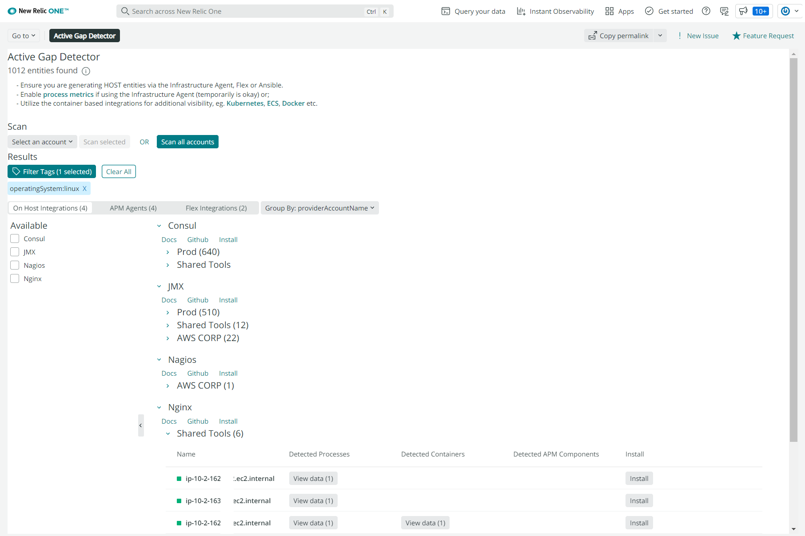
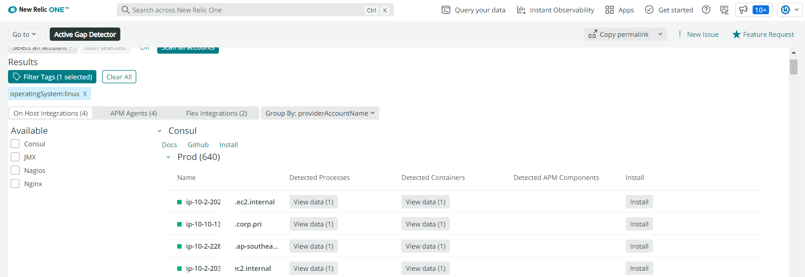

[](https://opensource.newrelic.com/oss-category/#new-relic-experimental)


# Active Gap Detector

Actively discover observability and telemetry gaps in your platform.

### Features
- On-demand scanning
- Identify teams/owners/users & more with any available tags
- Find and engage new teams and users, and follow up with a more streamlined approach with what is relevant to them
- Analyzes various data sources Infra Agent, Containers, K8s, ECS, APM Traces/Spans, Flex, Ansible.
- Tag filtering/grouping
- Both standard and flex integration suggestions, as well as APM
- Suggestions are easily extensible

### Improving and contributing to suggestions
- Contribute to the `integrations.json` file here:
  - https://github.com/newrelic-experimental/nr1-gaps/blob/master/integrations.json

### Screenshots




## Getting started

1. Ensure that you have [Git](https://git-scm.com/book/en/v2/Getting-Started-Installing-Git) and [NPM](https://www.npmjs.com/get-npm) installed. If you're unsure whether you have one or both of them installed, run the following command. (If you have them installed these commands will return a version number, if not, the commands won't be recognized.)

   ```bash
   git --version
   npm -v
   ```

2. Install the [New Relic One CLI](https://one.newrelic.com/launcher/developer-center.launcher) by going to [this link](https://one.newrelic.com/launcher/developer-center.launcher) and following the instructions (5 minutes or less) to install and set up your New Relic development environment.

3. Run the following command to clone this repository and run the code locally against your New Relic data:

   ```bash
   nr1 nerdpack:clone -r https://github.com/newrelic-experimental/nr1-gaps.git
   cd nr1-gaps
   nr1 nerdpack:serve
   ```

Visit [https://one.newrelic.com/?nerdpacks=local](https://one.newrelic.com/?nerdpacks=local), navigate to the Nerdpack, and :sparkles:

## Deploying this Nerdpack

Open a command prompt in the Nerdpack's directory, and run the following commands.

```bash
# To create a new uuid for the nerdpack so that you can deploy it to your account:
# nr1 nerdpack:uuid -g [--profile=your_profile_name]

# To see a list of APIkeys / profiles available in your development environment:
# nr1 profiles:list

nr1 nerdpack:publish [--profile=your_profile_name]
nr1 nerdpack:deploy [-c [DEV|BETA|STABLE]] [--profile=your_profile_name]
nr1 nerdpack:subscribe [-c [DEV|BETA|STABLE]] [--profile=your_profile_name]
```

## Support

New Relic hosts and moderates an online forum where customers can interact with New Relic employees as well as other customers to get help and share best practices. Like all official New Relic open source projects, there's a related Community topic in the New Relic Explorers Hub. You can find this project's topic/threads here:

https://discuss.newrelic.com/c/build-on-new-relic/nerdpacks

## Contributing
We encourage your contributions to improve! Keep in mind when you submit your pull request, you'll need to sign the CLA via the click-through using CLA-Assistant. You only have to sign the CLA one time per project.
If you have any questions, or to execute our corporate CLA, required if your contribution is on behalf of a company,  please drop us an email at opensource@newrelic.com.

## Security

As noted in our [security policy](https://github.com/newrelic-experimental/nr1-gaps/security/policy), New Relic is committed to the privacy and security of our customers and their data. We believe that providing coordinated disclosure by security researchers and engaging with the security community are important means to achieve our security goals.

If you believe you have found a security vulnerability in this project or any of New Relic's products or websites, we welcome and greatly appreciate you reporting it to New Relic through [HackerOne](https://hackerone.com/newrelic).

## License
Active Gap Detector is licensed under the [Apache 2.0](http://apache.org/licenses/LICENSE-2.0.txt) License.

Active Gap Detector also uses source code from third-party libraries. You can find full details on which libraries are used and the terms under which they are licensed in the [third-party notices](THIRD_PARTY_NOTICES.md) document.